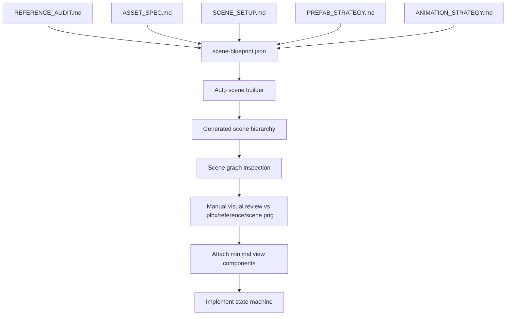

# Оценка подхода: начинать с автоматической сборки сцены

## 1. Короткий вывод

Подход **подходит для этого проекта**, но теперь должен быть совмещён с template-first миграцией: сцена собирается не как одноразовый мокап, а как **data-driven scene blueprint**, совместимый с slot template (`Slot`, `Columns`, `ElementConfiguration`, `ForcedSpawnManager`) и Save Toto anchors.

Главный риск: если начать только с визуального повторения `.plbx/reference/scene.png`, можно получить красивую, но непригодную для логики сцену. Поэтому scene-first нужно делать как `scene contract first`: структура, ссылки, состояния и animation anchors до скриптов, но с учётом будущей state machine.

## 2. Почему scene-first уместен именно здесь

| Причина | Эффект |
|---|---|
| Уже есть полный visual target `.plbx/reference/scene.png` | Можно быстро собрать композицию и проверить масштаб |
| Ассеты в основном статичные PNG | Генератор может стабильно разложить слои |
| Логика линейная и детерминированная | Сцена может задавать anchors для scripted sequence |
| Главные риски — визуальные слои и animation paths | Их лучше выявить до кода |
| Нужно избежать `find()`/ручного поиска нод | Автосборка может создать явные property refs/blueprint |

## 3. Что именно автоматизировать

1. Создание верхнеуровневых слоёв: `BackgroundLayer`, `ThreatLayer`, `SlotLayer`, `HudLayer`, `FxLayer`, `EndCardLayer`.
2. Создание template-compatible slot hierarchy: `Slot`, `Columns`, 5 column nodes, `System/ElementConfiguration`, `System/ForcedSpawnManager`.
3. Создание/инстанцирование prefabs из `PREFAB_STRATEGY.md`: slot symbols, baskets, locks, CTA, money burst.
4. Генерация/подключение `.anim` clips из `ANIMATION_STRATEGY.md` для prefabs.
5. Размещение ассетов/prefabs по layout из `SCENE_SETUP.md`.
6. Создание пустых anchor-нод для будущих анимаций:
   - `FloatingRewardRoot`
   - `CoinFxRoot`
   - `OpenLockFxRoot`
   - `PackshotRoot`
   - `EndTotoRoot`
7. Создание интерактивных targets:
   - `SpinButton`
   - `Basket_01..Basket_06`
   - `PlayNowButton`
8. Генерация data-файла со ссылками/именами для wiring.
9. Создание placeholder labels для `WIN`, balance, instruction и CTA.

## 4. Что не автоматизировать на первой итерации

| Не делать сразу | Почему |
|---|---|
| Финальную reel physics | Спин scripted, физика не нужна на scene-фазе |
| Сложные particles | Сначала проверить читаемость payoff |
| Полный paytable | Клиент ещё не подтвердил symbols/paytable |
| Pixel-perfect slicing `.plbx/reference/scene.png` | Это reference, не source layers |
| Ручные `.meta` | Их должен создать Cocos importer |

## 5. Предлагаемый pipeline



## 6. Blueprint-контракт

Минимальный data contract:

```json
{
  "canvas": { "width": 1080, "height": 1920 },
  "nodes": [
    {
      "name": "CageRoot",
      "parent": "ThreatLayer",
      "position": { "x": 60, "y": 470 },
      "size": { "width": 620, "height": 880 },
      "sprite": null,
      "children": []
    }
  ],
  "interactive": ["SpinButton", "Basket_01", "Basket_02", "Basket_03", "Basket_04", "Basket_05", "Basket_06", "PlayNowButton"],
  "prefabs": ["SaveTotoBasket", "SaveTotoLock", "SaveTotoSlotSymbol", "SaveTotoCtaButton", "SaveTotoMoneyBurst"],
  "animations": ["basket_selected", "lock_open_remove", "fire_level_transition", "money_pop", "cta_pulse"],
  "animationAnchors": ["LocksRoot", "FireRoot", "CoinFxRoot", "PackshotRoot"]
}
```

## 7. Guardrails против хардкода

- Все координаты — в config/blueprint, не в gameplay-коде.
- Runtime получает ссылки через properties, а не через `find()`.
- Названия нод — контракт сборки, но не способ доступа к ним в gameplay.
- State machine не знает о координатах; она вызывает методы view: `showBonus()`, `removeLock(index)`, `setFireLevel(level)`.
- Unlock-анимации замков считаются от explicit lock refs, а не от magic numbers. Key flight не входит в MVP.
- Любой visual change делается в blueprint/layout, а не в бизнес-логике.

## 8. Риски подхода и компенсации

| Риск | Компенсация |
|---|---|
| Сцена будет красивая, но без нужных anchors | `SCENE_SETUP.md` фиксирует anchors до генерации |
| Из-за отсутствия Cocos UUID нельзя привязать sprites | Оставить manual import step, не создавать `.meta` |
| Генератор закрепит неправильный layout | Быстро править `scene-blueprint.json`, не runtime-код |
| Изменения GDD потребуют перестройки сцены | Документировать source-of-truth и повторно запускать builder |
| Будущий код начнёт искать ноды по имени | Запретить в `AGENTS.md`, использовать explicit refs |

## 9. Рекомендуемая последовательность старта

1. Закрыть критичные open issues по paytable, CTA и auto-play или принять временные допущения.
2. Проверить, что ассеты лежат в runtime-папках Cocos-проекта (`assets/art`, `assets/fonts`).
3. Создать `scene-blueprint.json` из `SCENE_SETUP.md`.
4. Сгенерировать сцену/префабы с пустыми компонентами-view.
5. Провести visual QA против `.plbx/reference/scene.png`.
6. Только после этого реализовать state machine и scripted flow.

## 10. Итоговая оценка

Scene-first подход рекомендуется, но в форме:

```text
reference template + assets + prefabs + .anim clips + documented scene contract + auto blueprint + explicit wiring -> SaveToto logic
```

Не рекомендуется форма:

```text
manual pixel-perfect mockup -> logic searches nodes by names -> fixes in code
```

Первая форма снижает регрессии и хардкод. Вторая форма почти гарантированно создаст технический долг.
