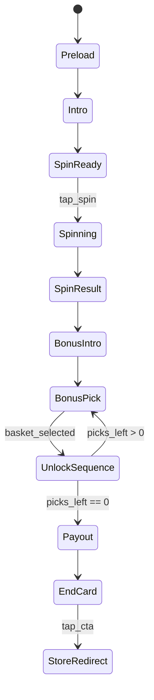

# Полный GDD — `Save Toto`

## 1. Краткое описание

`Save Toto` — вертикальный slot-playable, где один нажатый `SPIN` гарантированно запускает бонус `Pick-a-Basket`, а три выбора корзин освобождают Тото из клетки над огнём и приводят к большому выигрышу и CTA.

## 2. Цель и целевая аудитория

Цель playable — быстро показать понятную fantasy «спаси питомца и сорви большой выигрыш» через знакомые slot-сигналы: `SPIN`, scatter, bonus, ключи, замки, огонь, win counter и финальный CTA.

| Аспект | Требование |
|---|---|
| Аудитория | Мобильные игроки slot/casino puzzle UA, знакомые с tap-to-spin и bonus pick |
| Сессия | Короткая рекламная сессия без обучения длинным текстом |
| Эмоция | Срочность спасения Тото + ожидание награды за каждый pick |
| Исход | Только позитивный payoff; fail-финал отсутствует |
| Управление | Один палец: tap по `SPIN`, tap по корзинам, tap по CTA |

## 3. Игровой цикл

1. Показать вертикальную сцену: логотип, Тото в клетке, три замка, огонь, reel 5×3, `WIN`, баланс и `SPIN`.
2. Подсветить/пульсировать кнопку `SPIN`.
3. Игрок нажимает `SPIN`.
4. Барабаны вращаются и детерминированно останавливаются на раскладе с 3 scatter-символами Тото.
5. Показать `BONUS`-сигнал и перейти к bonus overlay.
6. Показать 6 корзин для выбора и подсказку `Pick a basket to free Toto`.
7. Игрок выбирает 1-ю корзину: показывается scripted reward, первый замок открывается/снимается, огонь снижается.
8. Игрок выбирает 2-ю корзину: показывается scripted reward, второй замок открывается/снимается, огонь снижается.
9. Игрок выбирает 3-ю корзину: показывается scripted reward, третий замок открывается/снимается, огонь гаснет.
10. Запускается переход в packshot с освобождённым Тото; balance докручивается, `WIN` остаётся фиксированным визуальным акцентом.
11. Показать end-card с логотипом, Тото, большим выигрышем и CTA.
12. Нажатие CTA выполняет переход в магазин.

## 4. Игровые состояния

| Состояние | Вход | Выход | Видимость / ограничения |
|---|---|---|---|
| `Preload` | Загрузка ассетов | Все обязательные ассеты доступны | Gameplay input заблокирован |
| `Intro` | Первый кадр | Короткий авто-показ угрозы | Видны клетка, огонь, HUD, reel |
| `SpinReady` | Intro завершён | `tap_spin` | Активна только кнопка `SPIN`; появляется после intro-анимации |
| `Spinning` | Нажат `SPIN` | Остановились все reels | Input заблокирован |
| `SpinResult` | Reels остановились | Scatter подсветка завершена | Подсветить 3 scatter-символа Тото |
| `BonusIntro` | Scatter засчитаны | Появилась сетка корзин | Reels затемнены/заменены bonus area |
| `BonusPick` | Ждём выбор | `basket_selected` | Активны только неоткрытые корзины; auto-pick выключен в MVP |
| `UnlockSequence` | Корзина выбрана | Замок снят | Input заблокирован до конца анимации |
| `Payout` | Три замка сняты | Balance counter/packshot завершены | Переход в packshot, Тото свободен |
| `EndCard` | Payout завершён | `tap_cta` | Только CTA button ведёт в store |
| `StoreRedirect` | CTA click | Завершение playable | Повторные клики не создают дублей |

## 5. Управление и ввод

| Ввод | Где активен | Результат | Edge cases |
|---|---|---|---|
| Tap по `SPIN` | `SpinReady` | Запускает scripted spin | Повторные taps игнорируются до конца spin |
| Tap по корзине | `BonusPick` | Открывает выбранную корзину | Открытая корзина повторно не выбирается |
| Tap по CTA button | `EndCard` | Store redirect | Повторный tap после redirect игнорируется; tap-anywhere выключен |
| Idle timeout | `SpinReady`, `BonusPick` | Нет auto-flow в MVP | Подсказки/pulse допустимы, auto-spin/auto-pick выключены |
| Tap вне активной зоны | Любое состояние | Нет действия | Не должен ломать sequence |

## 6. Игровые механики

### 6.1. Scripted slot spin

- Сетка: `5×3`.
- Спин всегда приводит к бонусному исходу.
- Три scatter-символа Тото видны в финальном раскладе.
- Остановка барабанов идёт слева направо.
- Anticipation разрешён на последних барабанах.

### 6.2. Scatter trigger

- Scatter-роль выполняет символ Тото (`assets/art/slot/symbol-toto.png`).
- Достаточно 3 scatter в любой позиции.
- Обычные line wins не являются главным исходом и могут быть визуально схлопнуты в общий `WIN`.

### 6.3. Pick-a-Basket

- На bonus-фазе показывается 6 корзин.
- Игрок выбирает 3 корзины.
- В каждой выбранной корзине показывается scripted reward; отдельный ключ и key flight в MVP не используются.
- Порядок наград детерминирован по номеру выбора, а не по позиции корзины.
- Не выбранные корзины остаются закрытыми.

### 6.4. Unlock progression

- В начале видны 3 замка.
- Каждый pick снимает один замок.
- Порядок замков: left → center → right.
- Огонь снижается после каждого снятого замка.
- После третьего замка запускается переход в packshot; клетка остаётся one-piece asset без door-swing.

### 6.5. Payout

- Три выбранные награды заранее scripted и ведут к финальному payoff.
- Balance докручивается/увеличивается; `WIN` используется как фиксированный visual label.
- Основной визуальный payoff: переход в packshot, свободный Тото, свет/частицы, CTA.

## 7. Уровни и прогрессия

В playable используется один scripted уровень без повторного прохождения.

| Фаза | Прогресс | Цель |
|---|---|---|
| Intro | `0/4` активных действий | Понять угрозу и увидеть SPIN |
| Spin | `1/4` | Получить 3 scatter |
| Pick 1 | `2/4` | Первый reward, левый замок |
| Pick 2 | `3/4` | Второй reward, центральный замок |
| Pick 3 | `4/4` | Третий reward, правый замок и packshot |
| End-card | Финал | CTA переход |

## 8. Персонажи и объекты

| Объект | Роль | Ассеты |
|---|---|---|
| Тото | Эмоциональный центр, цель спасения; reel scatter symbol | `assets/art/characters/toto-body.png`, `assets/art/characters/toto-head.png`, `assets/art/characters/toto-tongue.png`, `assets/art/slot/symbol-toto.png` |
| Клетка | One-piece threat asset; не открывается дверцей в MVP | `assets/art/scene/cage.png` |
| Замки | Три шага прогресса | `assets/art/scene/locks/lock-left.png`, `assets/art/scene/locks/lock-center.png`, `assets/art/scene/locks/lock-right.png`, `assets/art/scene/locks/open-lock.png` |
| Огонь | Таймер угрозы без реального fail | `assets/art/scene/fire.png` |
| Reel | Slot-поле | `assets/art/slot/reel.png`, `assets/art/slot/symbols_bg.png`, `assets/art/slot/symbol-basket.png`, `assets/art/slot/symbol-key.png`, `assets/art/slot/symbol-drop.png`, `assets/art/slot/symbol-oz.png`, `assets/art/slot/symbol-toto.png` |
| HUD | Состояние денег/выигрыша | `assets/art/ui/balance.png`, `assets/art/ui/win.png`, `assets/art/ui/spin.png` |
| Логотип | Бренд | `assets/art/logos/logo_woz_slots.png` |
| Свет/FX | Payoff и акценты | `assets/art/scene/light.png` |

## 9. Визуальный стиль

Визуал основан на `.plbx/reference/scene.png`: тёмная каменная локация, холодный teal/blue фон, тёплый оранжевый огонь, золотые замки и монеты, яркая зелёная кнопка `SPIN`.

| Зона | Примерная доля экрана | Содержимое |
|---|---:|---|
| Top brand | `0–15%` | Логотип слева сверху, цепь/верх клетки |
| Threat | `15–58%` | Клетка, Тото, замки, огонь |
| Reel/HUD | `58–88%` | Win/balance, slot grid 5×3 |
| Input | `88–100%` | Кнопка `SPIN` или CTA |

## 10. Звук и музыка

| Событие | Звук |
|---|---|
| Intro | Fire crackle, dog whimper |
| Spin start | Reel spin loop |
| Reel stop | Per-reel stop ticks |
| Scatter hit | Sparkle/chime, bonus stinger |
| Basket open | Basket pop/open |
| Lock unlock | Padlock snap/open |
| Fire reduce | Fire fade |
| Packshot transition | Positive transition whoosh/riser |
| Toto freed | Happy bark |
| Big win | Coin shower + win stinger |
| CTA | Short positive jingle |

Если звук отключён рекламной средой, вся последовательность должна оставаться понятной визуально.

## 11. UI и HUD

| Экран/слой | Элемент | Видимость | Поведение |
|---|---|---|---|
| Gameplay | `LOGO` | Intro–Payout | В safe area, не перекрывает клетку |
| Gameplay | `BalancePanel` | Intro–Payout | Balance увеличивается/докручивается на payout |
| Gameplay | `WinPanel` | Intro–Payout | Фиксированный visual label/panel; не главный counter |
| Gameplay | `SpinButton` | `SpinReady` | Пульсирует, принимает один tap |
| Reel | `ReelGrid` | Intro–SpinResult | 5×3 символов, scatter видны на result |
| Bonus | `BasketGrid` | BonusIntro–BonusPick | 6 корзин, 3 выбираются |
| Bonus | `InstructionLabel` | BonusIntro–Pick 3 | Короткая подсказка действия |
| Threat | `Locks` | Intro–Pick 3 | Скрываются/падают по одному |
| Threat | `Fire` | Intro–Payout | Масштаб/интенсивность снижается |
| End-card | `PlayNowButton` | EndCard | Пульсирует, главный CTA |

## 12. Константы и параметры

| Имя | Значение | Единица | Описание |
|---|---:|---|---|
| `canvasWidth` | `1080` | px | Целевой дизайн-портрет |
| `canvasHeight` | `1920` | px | Целевой дизайн-портрет |
| `reelColumns` | `5` | count | Количество барабанов |
| `reelRows` | `3` | count | Количество рядов |
| `scatterRequired` | `3` | count | Триггер бонуса |
| `basketCount` | `6` | count | Количество корзин в бонусе |
| `requiredPicks` | `3` | count | Количество выборов игрока |
| `activeTapCount` | `4` | count | 1 spin + 3 picks |
| `introDuration` | `1.2` | sec | Авто-показ угрозы |
| `spinDuration` | `2.6` | sec | Общая длительность spin |
| `bonusIntroDuration` | `0.8` | sec | Появление корзин |
| `unlockSequenceDuration` | `1.0` | sec | Один pick → lock-open/remove animation |
| `payoutDuration` | `2.4` | sec | Balance counter + packshot payoff |
| `idleSpinDelay` | `0` | sec | Auto-spin выключен в MVP |
| `idlePickDelay` | `0` | sec | Auto-pick выключен в MVP |
| `finalWinValue` | `10000000` | credits | Рабочее значение из `.plbx/reference/scene.png` |
| `startingBalance` | `555000` | credits | Рабочее значение из `.plbx/reference/scene.png` |

## 13. Ассеты

| ID | Тип | Файл | Описание |
|---|---|---|---|
| `scene_reference` | reference | `.plbx/reference/scene.png` | Композитный визуальный ориентир, не runtime-ассет |
| `background` | image | `assets/art/backgrounds/background.png` | Каменный фон |
| `logo` | image | `assets/art/logos/logo_woz_slots.png` | The Wizard of Oz Slots logo |
| `cage` | image | `assets/art/scene/cage.png` | Клетка |
| `toto_body` | image | `assets/art/characters/toto-body.png` | Тело Тото для сборки персонажа |
| `toto_head` | image | `assets/art/characters/toto-head.png` | Голова Тото |
| `toto_tongue` | image | `assets/art/characters/toto-tongue.png` | Язык/эмоция Тото |
| `fire` | image | `assets/art/scene/fire.png` | Пламя под клеткой |
| `lock_left` | image | `assets/art/scene/locks/lock-left.png` | Левый замок |
| `lock_center` | image | `assets/art/scene/locks/lock-center.png` | Центральный замок |
| `lock_right` | image | `assets/art/scene/locks/lock-right.png` | Правый замок |
| `open_lock` | image | `assets/art/scene/locks/open-lock.png` | Открытый/падающий замок |
| `reel_frame` | image | `assets/art/slot/reel.png` | Декоративная рамка reel |
| `symbol_bg` | image | `assets/art/slot/symbols_bg.png` | Подложка символа |
| `symbol_basket` | image | `assets/art/slot/symbol-basket.png` | Basket bonus visual / regular symbol |
| `symbol_key` | image | `assets/art/slot/symbol-key.png` | Ключ/bonus key source |
| `symbol_drop` | image | `assets/art/slot/symbol-drop.png` | Тематический символ |
| `symbol_oz` | image | `assets/art/slot/symbol-oz.png` | Low-pay Oz symbol |
| `symbol_toto` | image | `assets/art/slot/symbol-toto.png` | Toto reel symbol / scatter |
| `balance_panel` | image | `assets/art/ui/balance.png` | Баланс |
| `win_panel` | image | `assets/art/ui/win.png` | WIN panel |
| `spin_button` | image | `assets/art/ui/spin.png` | SPIN button |
| `light_fx` | image | `assets/art/scene/light.png` | Световой payoff FX |
| `money_dollar_coin` | image | `assets/art/fx/money/money-dollar-coin.webp` | Dollar coin payoff/money FX |
| `money_gold_coins` | image | `assets/art/fx/money/money-gold-coins.png` | Gold coin pile payoff/money FX |
| `money_gold_bricks` | image | `assets/art/fx/money/money-gold-bricks.webp` | Gold bricks reward/payoff variant |
| `money_coin_stack_01` | image | `assets/art/fx/money/money-coin-stack-01.png` | Coin stack payoff FX |
| `money_coin_stack_02a` | image | `assets/art/fx/money/money-coin-stack-02a.png` | Coin stack payoff FX |
| `money_coin_stack_02b` | image | `assets/art/fx/money/money-coin-stack-02b.png` | Coin stack payoff FX |
| `money_coin_stack_03` | image | `assets/art/fx/money/money-coin-stack-03.png` | Large coin stack payoff FX |
| `money_dollar_coin_large` | image | `assets/art/fx/money/money-dollar-coin-large.png` | Dollar coin payoff FX variant |
| `reward_10m` | image | `assets/art/ui/rewards/reward-10m.webp` | Amount label fallback/reference sprite |
| `reward_100m` | image | `assets/art/ui/rewards/reward-100m.webp` | Amount label fallback/reference sprite |
| `font_bodega_black` | font | `assets/fonts/bodegasans/Bodega Sans Black.ttf` | UI-текст |
| `font_bodega_light` | font | `assets/fonts/bodegasans/Bodega Sans Light.ttf` | Вторичный UI-текст |

## 14. Обработка ошибок

| Условие | Ожидаемое поведение |
|---|---|
| Не загрузился декоративный символ reel | Использовать `assets/art/slot/symbols_bg.png` + ближайший доступный символ, не блокировать playable |
| Не загрузился ключ | Не блокировать flow: key flight отсутствует в MVP, использовать lock-open animation |
| Не загрузился отдельный замок | Использовать доступный lock-ассет с зеркалированием/масштабом |
| Игрок нажал SPIN несколько раз | Первый tap принимается, остальные игнорируются |
| Игрок нажал открытую корзину | Tap игнорируется, подсветить оставшиеся доступные корзины |
| Tap во время animation lock | Tap игнорируется до следующего состояния |
| CTA нажат повторно | Не создавать повторный redirect |
| Неверная ориентация | Сохранять playable в safe area, не обрезать CTA |

## 15. Аналитика и события

| Event name | Trigger | Payload |
|---|---|---|
| `game_start` | Первый готовый кадр | `{ projectId, creativeId }` |
| `intro_shown` | Показ угрозы | `{ state: "Intro" }` |
| `spin_click` | Tap по SPIN | `{ tapIndex: 1 }` |
| `spin_result` | Reels остановились | `{ scatterSymbol: "toto", scatters: 3 }` |
| `bonus_start` | Появилась сетка корзин | `{ basketCount: 6, requiredPicks: 3 }` |
| `basket_pick` | Игрок выбрал корзину | `{ pickIndex, basketIndex, rewardId }` |
| `lock_removed` | Замок снят | `{ lockIndex, locksRemaining }` |
| `fire_level_changed` | Огонь снижен | `{ fireLevel }` |
| `toto_freed` | Packshot transition показывает свободного Тото | `{ picks: 3 }` |
| `balance_count_start` | Старт balance/final value counter | `{ targetValue }` |
| `balance_count_complete` | Balance/final value counter завершён | `{ finalValue }` |
| `cta_shown` | End-card показан | `{ finalWin }` |
| `cta_click` | CTA button tap | `{ network, platform }` |
| `store_redirect` | Redirect вызван | `{ urlType }` |

## 16. Ограничения и допущения

| Тип | Описание |
|---|---|
| Допущение | `.plbx/reference/scene.png` является примерным визуальным направлением, а не pixel-perfect спецификацией |
| Допущение | `finalWinValue = 10,000,000` и `startingBalance = 555,000` взяты из `.plbx/reference/scene.png` до клиентского ревью |
| Допущение | В проекте есть чистый Cocos runtime; slot template из `.plbx/reference/slot-game/` будет адаптирован как база логики |
| Ограничение | Не использовать fail-финал: Тото всегда освобождается |
| Ограничение | Не создавать ручные `.meta`, если проект будет импортирован в Cocos Creator |
| Ограничение | Не хардкодить поиск нод по имени в runtime; сцена должна иметь явные property-ссылки |
| Ограничение | Брендовые элементы WOZ/Zynga используются в рамках рекламы для Zynga/правообладателя; production использует предоставленные/разрешённые ассеты |

## 17. Чеклист соответствия

- [x] YAML front matter present and complete
- [x] All 18 sections present
- [x] All states enumerated with transitions
- [x] All inputs mapped per platform
- [x] Asset manifest complete with current files
- [x] All constants in the constants table
- [x] Error handling covers stated failure modes
- [x] Code Agent Handoff section unambiguous
- [x] No architecture/library prescriptions in gameplay rules
- [x] All prose in Russian; identifiers/code in English

## 18. Передача агенту-кодировщику / Code Agent Handoff

Перед реализацией агент обязан прочитать:

1. `.plbx/game-design/GDD.md`
2. `.plbx/game-design/OPEN_ISSUES.md`
3. `.plbx/game-design/ASSET_SPEC.md`
4. `.plbx/game-design/SCENE_SETUP.md`
5. `.plbx/game-design/AUTO_SCENE_ASSEMBLY_PLAN.md`
6. `.plbx/game-design/REFERENCE_AUDIT.md`
7. `.plbx/game-design/PREFAB_STRATEGY.md`
8. `.plbx/game-design/ANIMATION_STRATEGY.md`
9. `ARCHITECTURE.md`
10. `AGENTS.md`

Acceptance criteria первой реализации:

- Сцена собирается из предоставленных ассетов, project-specific prefabs, `.anim` clips и template-compatible `Slot/Columns` contract.
- `SPIN` запускает template-derived scripted 5×3 spin с 3 scatter-символами Тото.
- Bonus показывает 6 корзин и принимает 3 выбора.
- Каждый выбор снимает один замок слева направо и снижает огонь.
- После третьего выбора запускается packshot/payoff, balance докручивается, `WIN` остаётся фиксированным visual label.
- End-card показывает CTA; tap вызывает store redirect stub/adapter.
- Нет runtime-поиска критичных нод по имени; ссылки передаются явно.
- Visual animations are triggered through prefab/view `.anim` clips, not hardcoded in state machine.
- `.plbx/reference/slot-game/` используется как база логики, `.plbx/reference/other-assets/` — только как reference решений.
