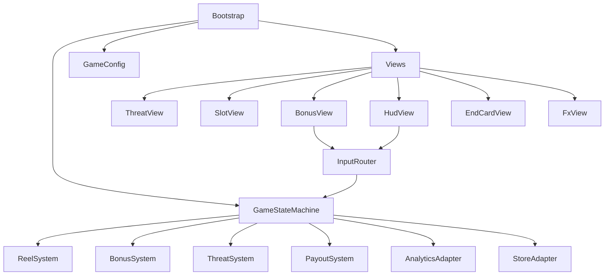
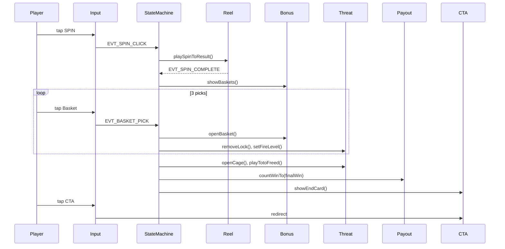

# ARCHITECTURE.md — технический план `Save Toto`

## 1. Назначение

Документ описывает технические контракты реализации playable `Save Toto`: state machine, модули, события, config, view boundaries и правила сцены. Реализация должна соответствовать `.plbx/game-design/GDD.md`, `SCENE_SETUP.md` и `AUTO_SCENE_ASSEMBLY_PLAN.md`.

## 2. Текущий статус проекта

В текущем каталоге создан чистый Cocos Creator 3.8.8 проект; runtime-код ещё не реализован. Архитектура ниже является планом первой реализации.

## 3. Верхнеуровневая архитектура



## 4. Модули

| Модуль | Ответственность | Не должен делать |
|---|---|---|
| `Bootstrap` | Связать config, systems, views, adapters | Искать ноды по имени в runtime |
| `GameStateMachine` | Управлять состояниями playable | Знать координаты или sprites |
| `ReelSystem` | Scripted spin, reel result, scatter detection | Управлять bonus picks |
| `BonusSystem` | Корзины, picks, rewards | Анимировать клетку напрямую |
| `ThreatSystem` | Locks/fire/cage/Toto progression | Считать win formula |
| `PayoutSystem` | Win counter, final payoff | Делать store redirect |
| `InputRouter` | Принять taps и передать валидные events | Менять состояние без state machine |
| `AnalyticsAdapter` | Отправка событий | Блокировать gameplay при ошибке аналитики |
| `StoreAdapter` | CTA redirect | Запускаться до EndCard |

## 5. State machine

Состояния должны совпадать с GDD:

```text
Preload
Intro
SpinReady
Spinning
SpinResult
BonusIntro
BonusPick
UnlockSequence
Payout
EndCard
StoreRedirect
```

Переходы выполняются только через state machine. View-компоненты не должны самостоятельно менять глобальное состояние.

## 6. Config contract

```ts
export interface SaveTotoConfig {
  projectId: 'WOZ_B1_C3_SaveToto';
  canvas: { width: number; height: number };
  reel: {
    columns: 5;
    rows: 3;
    spinDurationSeconds: number;
    scatterRequired: number;
    scriptedResult: ReelSymbolId[][];
  };
  bonus: {
    basketCount: 6;
    requiredPicks: 3;
    rewardsByPickIndex: BonusReward[];
    idlePickDelaySeconds: number;
    autoPickEnabled: boolean;
  };
  threat: {
    lockOrder: Array<'left' | 'center' | 'right'>;
    initialFireLevel: 3;
  };
  payout: {
    startingBalance: number;
    finalWinValue: number;
    countDurationSeconds: number;
  };
  cta: {
    label: string;
    tapAnywhereOnEndCard: boolean;
    iosUrl?: string;
    androidUrl?: string;
  };
  idle: {
    autoSpinEnabled: boolean;
    spinDelaySeconds: number;
  };
}
```

## 7. View API contract

```ts
interface ThreatView {
  setFireLevel(level: 0 | 1 | 2 | 3): void;
  removeLock(index: number): Promise<void>;
  openCage(): Promise<void>;
  playTotoFreed(): Promise<void>;
}

interface SlotView {
  showIdleReel(result: ReelSymbolId[][]): void;
  playSpinToResult(result: ReelSymbolId[][]): Promise<void>;
  highlightScatters(): Promise<void>;
  setWinValue(value: number): void;
  countWinTo(value: number, durationSeconds: number): Promise<void>;
}

interface BonusView {
  showBaskets(): Promise<void>;
  hideBaskets(): Promise<void>;
  setBasketEnabled(index: number, enabled: boolean): void;
  openBasket(index: number, reward: BonusReward): Promise<void>;
}

interface HudView {
  showSpinButton(active: boolean): void;
  showCtaButton(active: boolean): void;
}
```

## 8. Event names

| Event | Direction | Payload |
|---|---|---|
| `EVT_GAME_START` | system → analytics | `{ projectId }` |
| `EVT_SPIN_CLICK` | input → state | `{}` |
| `EVT_SPIN_COMPLETE` | reel → state | `{ scatterCount }` |
| `EVT_BONUS_START` | state → analytics | `{ basketCount }` |
| `EVT_BASKET_PICK` | input → state | `{ basketIndex }` |
| `EVT_REWARD_REVEALED` | bonus → analytics | `{ pickIndex, rewardId }` |
| `EVT_LOCK_REMOVED` | threat → analytics | `{ lockIndex }` |
| `EVT_TOTO_FREED` | threat → analytics | `{}` |
| `EVT_CTA_SHOWN` | state → analytics | `{ finalWin }` |
| `EVT_CTA_CLICK` | input → store | `{}` |

## 9. Правила scene wiring

- Все обязательные ссылки передаются через serialized properties или generated wiring map.
- Запрещены `find()`, `getChildByName()` и массовые `getComponentsInChildren()` для gameplay-контрактов.
- Ноды из `SCENE_SETUP.md` можно использовать для генерации и инспекции, но runtime не должен зависеть от строковых путей.
- `.plbx/reference/scene.png` не должен попадать в production bundle без необходимости.

## 10. Mermaid sequence основного flow



## 11. Acceptance criteria архитектуры

- State machine воспроизводит полный flow без прямых зависимостей от координат.
- View API покрывает все визуальные действия GDD.
- Config содержит все числа, не оставляя magic numbers в логике.
- Input блокируется во время animation lock.
- CTA redirect изолирован в adapter.
- Analytics failures не блокируют playable.
