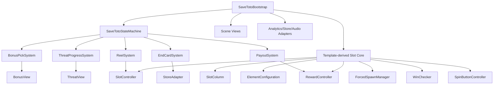
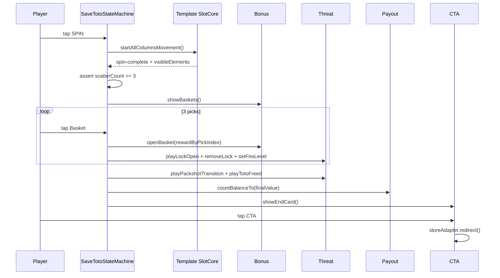

# ARCHITECTURE.md — технический план `Save Toto`

## 1. Назначение

Документ описывает технические контракты реализации playable `Save Toto`: state machine, адаптацию slot template, модули, события, config, view boundaries и правила сцены. Реализация должна соответствовать `.plbx/game-design/GDD.md`, `.plbx/game-design/REFERENCE_AUDIT.md`, `SCENE_SETUP.md` и `AUTO_SCENE_ASSEMBLY_PLAN.md`.

## 2. Текущий статус проекта

В текущем каталоге создан чистый Cocos Creator 3.8.8 проект; runtime-ассеты разложены в `assets/art/`. В `.plbx/reference/slot-game/` добавлен готовый Cocos slot template, который берётся за основу логики. В `.plbx/reference/other-assets/` добавлен параллельный Oz-like проект для подсмотра scene/VFX/audio/CTA решений.

## 3. Reference-first + scene-first стратегия

Целевой workflow:

```text
REFERENCE_AUDIT -> ASSET_SPEC -> SCENE_SETUP -> template module import/adaptation -> scene blueprint -> generated scene -> explicit wiring -> SaveToto state machine
```

Не копировать reference-проекты целиком. Переносить только проверенные модули, переименовывая production-классы под `SaveToto*` для поддержки и навигации.

## 4. Верхнеуровневая архитектура



## 5. Template-derived modules

| Целевой модуль | Reference source | Статус использования |
|---|---|---|
| `SaveTotoBootstrap` | `slot-game/assets/scripts/controllers/Bootstrap.ts` + `other-assets/.../Bootstrap.ts` | Адаптировать: DI, `game_ready`, state machine, no generic CTA-after-spins |
| `SlotController` | `slot-game/assets/scripts/Slot/SlotController.ts` | Взять основу; настроить 5 columns; добавить scatter trigger bridge |
| `SlotColumn` / `ColumnMover` | `slot-game/assets/scripts/Slot/SlotColumn.ts`, `ColumnMover.ts` | Взять основу движения колонок |
| `ElementConfiguration` | `slot-game/assets/scripts/Slot/Elements/ElementConfiguration.ts` | Взять Inspector config для symbols/scatter |
| `ForcedSpawnManager` | `other-assets/scripts/Slot/managers/ForcedSpawnManager.ts` | Предпочесть enhanced version с `hasRulesForSpin()` |
| `WinChecker` | `slot-game/assets/scripts/Slot/WinChecker.ts` | Адаптировать: 5×3 paylines optional, scatter count mandatory |
| `SpinButtonController` | `other-assets/scripts/controllers/SpinButtonController.ts` | Взять pulse/tutorial fade + input lock |
| `RewardController` | `slot-game/assets/scripts/controllers/RewardController.ts` | Адаптировать под scripted `WIN` counter |
| `CTAScreen` | `other-assets/scripts/Slot/CTAScreen.ts` | Взять fade + `plbx_html_playable.download()` pattern |
| `OrientationController` | `other-assets/scripts/controllers/OrientationController.ts` | Reference для adaptive; не обязателен в MVP |
| `AudioController` | `other-assets/scripts/audio/*` | Reference для audio unlock; подключать после visual MVP |

## 6. Save Toto-specific modules

| Модуль | Ответственность | Не должен делать |
|---|---|---|
| `SaveTotoStateMachine` | Управлять состояниями Intro/Spin/Bonus/Payout/EndCard | Искать ноды, считать координаты |
| `ReelSystem` | Запустить template spin, дождаться result, проверить scatter | Управлять корзинами и замками |
| `BonusPickSystem` | 6 корзин, 3 picks, reward-by-pick-index | Запускать reel physics |
| `ThreatProgressSystem` | Locks/fire/cage/Toto progression | Считать reward formula |
| `PayoutSystem` | Scripted final WIN counter and payoff timing | Делать store redirect |
| `LockUnlockController` | Анимация открытого/снятого замка без key flight | Хранить gameplay state |
| `StoreAdapter` | CTA redirect через Playbox/network API | Запускаться до EndCard |
| `AnalyticsAdapter` | Events forwarding | Блокировать flow при ошибке аналитики |

## 7. State machine

Состояния должны совпадать с GDD:

```text
Preload
Intro
SpinReady
Spinning
SpinResult
BonusIntro
BonusPick
UnlockSequence
Payout
EndCard
StoreRedirect
```

Template события (`spin-started`, `spin-complete`, `win-detected`) являются внутренними сигналами reel core. Глобальные переходы выполняются только через `SaveTotoStateMachine`.

## 8. Config contract

```ts
export interface SaveTotoConfig {
  projectId: 'WOZ_B1_C3_SaveToto';
  canvas: { width: number; height: number };
  reel: {
    columns: 5;
    rows: 3;
    totalElementsPerColumn: number;
    elementSpacing: number;
    startIntervalSeconds: number;
    spinDurationSeconds: number;
    scatterElementId: number; // Toto symbol id
    scatterRequired: 3;
    scriptedResult: ReelSymbolId[][];
    forcedRules: Array<{ spin: number; line: number; count: number; elementId: number }>;
  };
  symbols: {
    totoScatterId: number;
    basketId: number;
    keyId: number; // regular/fallback symbol, not MVP key flight
    totoId: number;
    dropId: number;
    ozId: number;
  };
  bonus: {
    basketCount: 6;
    requiredPicks: 3;
    rewardsByPickIndex: BonusReward[];
    idlePickDelaySeconds: 0;
    autoPickEnabled: false;
  };
  threat: {
    lockOrder: Array<'left' | 'center' | 'right'>;
    initialFireLevel: 3;
  };
  payout: {
    startingBalance: number;
    finalWinValue: number;
    countDurationSeconds: number;
  };
  cta: {
    label: string;
    tapAnywhereOnEndCard: false;
    iosUrl?: string;
    androidUrl?: string;
  };
  idle: {
    autoSpinEnabled: false;
    spinDelaySeconds: 0;
  };
}
```

## 9. View API contract

```ts
interface ThreatView {
  setFireLevel(level: 0 | 1 | 2 | 3): void;
  removeLock(index: number): Promise<void>;
  playPackshotTransition(): Promise<void>;
  playTotoFreed(): Promise<void>;
}

interface SlotView {
  showIdleReel(result: ReelSymbolId[][]): void;
  playSpinToResult(result: ReelSymbolId[][]): Promise<void>;
  highlightScatters(): Promise<void>;
  getScatterCount(): number;
  setBalanceValue(value: number): void;
  countBalanceTo(value: number, durationSeconds: number): Promise<void>;
}

interface BonusView {
  showBaskets(): Promise<void>;
  hideBaskets(): Promise<void>;
  setBasketEnabled(index: number, enabled: boolean): void;
  openBasket(index: number, reward: BonusReward): Promise<void>;
  getBasketAnchor(index: number): Node;
}

interface HudView {
  showSpinButton(active: boolean): void;
  showCtaButton(active: boolean): void;
}
```

## 10. Event names

| Event | Direction | Payload |
|---|---|---|
| `EVT_GAME_START` | system → analytics | `{ projectId }` |
| `EVT_SPIN_CLICK` | input → state | `{}` |
| `EVT_TEMPLATE_SPIN_STARTED` | template → state/audio | `{}` |
| `EVT_TEMPLATE_SPIN_COMPLETE` | template → state | `{ visibleElements, scatterSymbol: "toto", scatterCount }` |
| `EVT_SPIN_RESULT` | state → analytics | `{ scatters: 3 }` |
| `EVT_BONUS_START` | state → analytics | `{ basketCount }` |
| `EVT_BASKET_PICK` | input → state | `{ basketIndex }` |
| `EVT_REWARD_REVEALED` | bonus → analytics | `{ pickIndex, rewardId }` |
| `EVT_LOCK_REMOVED` | threat → analytics | `{ lockIndex }` |
| `EVT_TOTO_FREED` | threat → analytics | `{}` |
| `EVT_CTA_SHOWN` | state → analytics | `{ finalWin }` |
| `EVT_CTA_CLICK` | input → store | `{}` |

## 11. Правила scene wiring

- Целевая сцена должна быть совместима с template core: `Slot`, `Columns`, 5 column nodes, `SpinButton`, `RewardController`, `System/ElementConfiguration`, `System/ForcedSpawnManager`.
- Все обязательные ссылки передаются через serialized properties или generated wiring map.
- Запрещены `find()`, `getChildByName()` и массовые `getComponentsInChildren()` для gameplay-контрактов.
- Ноды из `SCENE_SETUP.md` можно использовать для генерации и инспекции, но runtime не должен зависеть от строковых путей.
- `.plbx/reference/**` не должен попадать в production bundle.

## 12. Mermaid sequence основного flow



## 13. Acceptance criteria архитектуры

- Template slot core перенесён/адаптирован модульно, не copy-all reference project.
- Reel работает как 5 columns × 3 rows.
- Scatter-count по символу Тото, а не generic line win, запускает bonus.
- Forced result гарантирует scripted scatter outcome.
- CTA показывается после Toto freed + payout, а не просто после окончания spins.
- Config содержит все числа, не оставляя magic numbers в логике. Auto-spin/auto-pick выключены в MVP.
- Input блокируется во время animation lock.
- Store redirect изолирован в adapter; активна только CTA button, tap-anywhere выключен.
- Analytics/audio failures не блокируют playable.

## 14. Prefab architecture

Production prefabs создаются под `assets/prefabs/save-toto/**` и используют project-specific scripts/classes. Prefabs являются reusable объектами, а не raw assets:

```text
Raw asset -> SaveToto prefab -> generated scene instance -> explicit runtime refs
```

Обязательные MVP prefabs:

| Prefab | Назначение | Reference policy |
|---|---|---|
| `SaveTotoSlotSymbol.prefab` | Slot symbol cell: bg + icon + highlight hooks | Не зависит от `.plbx/reference/**` |
| `SaveTotoBasket.prefab` | Bonus basket: sprite + button + reward label + selected animation | Без open-basket sprite |
| `SaveTotoLock.prefab` | Lock view: left/center/right/open animation | Без key flight |
| `SaveTotoCtaButton.prefab` | CTA button only redirect target | Visual pattern may reference `other-assets`, production asset свой |

Prefab generation может быть автоматизирована через blueprint/editor workflow, но `.meta` не создаются вручную. Scene builder должен инстанцировать prefabs и заполнять serialized references.
